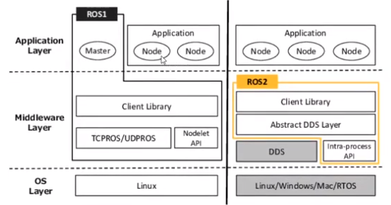

* ROS1 is more complete. It has a lot more packages than ROS2. ROS2 has some interesting features.
* For real-time control ROS2 is going to be much better than ROS1.
* DDS is a communication standard which is already used in industry, military applications,
etc..
* ROS2 has a Abstract DDS Layer, which contains many different implementations of DDS
and you can switch between them.
* If you want to have very low level control over communication, ROS2 is better.
* Some DDS implementations are not open source.
```
ros2 doctor --report
```

* Fast RTPS is a vendor.

* Both Fast-RTPS and CycloneDDS have an intra-process communication mechanism. Communication
inside the same process.
