# ROS2 For Beginners
This repo contains my notes and code for the [ROS2 For Beginners (ROS Foxy - 2021)](https://www.udemy.com/share/103tOUAEcadVxQR3Q=/) on Udemy.

Final project of the course with turtlesim using a P controller. Code can be found in ```packages/turtlesim_catch_them_all``` submodule.

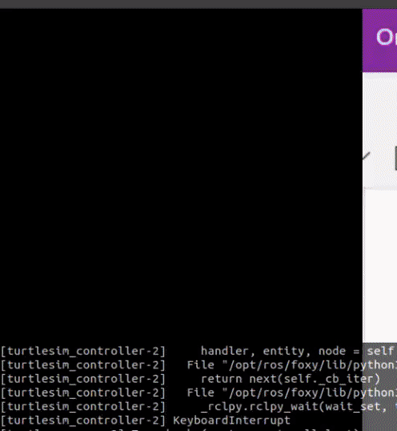

## Requirements
* Ubuntu 20

You can try to install on Windows and Mac too.

Clone this repository:
```
git clone --recurse-submodules git@github.com:saratrajput/learning_ros2.git
```

## ROS2 with Anaconda
In case you have installed Anaconda too and are having problems running the examples:
* Then first deactivate the base Anaconda environment.
```
conda deactivate
```
Your terminal should change from:
```
(base)user@pc-name:~$
```
to:
```
user@pc-name:~$
```


* Delete **build**, **install** and **log** directory from your ROS2 Workspace
```
cd ros2_ws/
rm -r build/ install/ log/
```

* Build all the packages again:
```
colcon build --symlink-install
```

* Launch final project launch file to make sure everything is running fine.
```
ros2 launch my_robot_bringup turtlesim_catch_them_all.launch.py
```
If the turtle is catching other turtles and the behaviour is similar to the GIF shown above, then everything is running fine.


## Instructions

* Install the latest ROS2 distribution with LTS. Find the distributions
  [here](https://index.ros.org/doc/ros2/Releases/).

* We will install [ROS2 Foxy](https://index.ros.org/doc/ros2/Installation/Foxy/).

* Install locales first
```
locale  # check for UTF-8

sudo apt update && sudo apt install locales
sudo locale-gen en_US en_US.UTF-8
```

* We will install ROS2 via Debian Packages.
```
sudo apt update && sudo apt install curl gnupg2 lsb-release
curl -s https://raw.githubusercontent.com/ros/rosdistro/master/ros.asc | sudo apt-key add -
sudo sh -c 'echo "deb [arch=$(dpkg --print-architecture)] http://packages.ros.org/ros2/ubuntu $(lsb_release -cs) main" > /etc/apt/sources.list.d/ros2-latest.list'
```

* Install all packages
```
sudo apt update
sudo apt install ros-foxy-desktop
```

* This is optional. Can be useful for python development
```
sudo apt install -y python3-pip
pip3 install -U argcomplete
```

### Try some examples

* Start a talker
```
source /opt/ros/foxy/setup.bash
ros2 run demo_nodes_cpp talker
```

* In another terminal, start listener

```
source /opt/ros/foxy/setup.bash
ros2 run demo_nodes_py listener
```

### Install ROS2 Build tool - Colcon

```
sudo apt install python3-colcon-common-extensions
```

* Enable auto-complete for colcon
```
source /usr/share/colcon_argcomplete/hook/colcon-argcomplete.bash
```

### Sourcing
Add the following to your .bashrc
```
# Source ROS2 Foxy
source /opt/ros/foxy/setup.bash
# Ros2 workspace
source ~/ros2_ws/install/setup.bash

# Source colcon argcomplete (For Ros2)
source /usr/share/colcon_argcomplete/hook/colcon-argcomplete.bash
```

### Create workspace and build

```
mkdir ros2_ws
cd ros2_ws
mkdir src
colcon build
source install/setup.bash
```
Note: There is also local_setup.bash inside install folder. This sources only the local
directory. We don't need to know about this nuance at this stage.

### Create a Python package

```
cd ~/ros2_ws/src/
ros2 pkg create my_py_pkg --build-type ament_python --dependencies rclpy
# A folder named my_py_pkg is created. You place your scripts inside my_py_pkg/my_py_pkg
# directory
cd ~/ros2_ws
colcon build
OR
colcon build --packages-select my_py_pkg
```

### Create a C++ package

```
cd ~/ros2_ws/src/
ros2 pkg create my_cpp_pkg --build-type ament_cmake --dependencies rclcpp
cd ~/ros2_ws/
colcon build
OR
colcon build --packages-select my_cpp_pkg
```

### ROS2 Nodes
* Subprograms in your application, responsible for only one thing.
* Combined into a graph.
* Communicate with each other through topics, services, and parameters.


Benefits:
* Reduce code complexity.
* Fault tolerance.
* Can be written in Python, C++, .... One node can be written in Python and another in C++
  and they can communicate easily with each other.


## ROS2 Language Libraries

### RCL
* Ros client Library.
* Pure C library.
* Uses DDS: Data distribution service
* We don't use RCL directly, but the client libraries built on top of it like rclcpp for
  Cpp nodes and rclpy for Python nodes. 


## Intro to ROS2 Tools

### Debug and Monitor your nodes with ros2 cli

* ros2 node
```
ros2 node list
```

```
ros2 node info <node_name>
ros2 node info /py_test
```

* /rosout: Gets all the logs of all the applications.

**NOTE: You shouldn't launch the same node with the same name more than once.**
You'll get this error in ```ros2 node list``` output:

```
WARNING: Be aware that there are nodes in the graph that share an exact name, this can
have unintended side effects.
```
And for ```ros2 node info /py_test```
```
ros2 node info /py_test
There are 2 nodes in the graph with the exact name "/py_test". You are seeing information about only one of them.
/py_test
```

* Rename a Node at Runtime
```
ros2 run my_py_pkg py_node --ros-args --remap __node:=abc
```
The node is now named **abc**.

### Colcon

* Build all packages
```
colcon build
```

* Build a single package
```
colcon build --packages-select my_py_pkg
```

* Make sure to have this line in your .bashrc for colcon auto-completion to work
```
source /usr/share/colcon_argcomplete/hook/colcon-argcomplete.bash
```

* For **python** nodes, if you compile with the following line, then you don't need
to compile everytime. It creates a symlink to the python executable in your
package
```
colcon build --packages-select my_py_pkg --symlink-install
```
* Make sure the python file is an executable.
```
chmod +x my_first_node.py
```

### Rqt and rqt\_graph

* To start rqt:
```
rqt
```

* To open node graph:
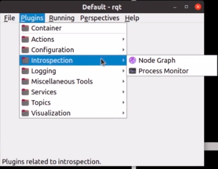

* Or you can directly open rqt\_graph:
```
rqt_graph
```

### Turtlesim

* Launch turtlesim
```
ros2 run turtlesim turtlesim_node
```

* Launch turtlesim\_teleop\_key to control the turtle
```
ros2 run turtlesim turtle_teleop_key
```

* With rqt_graph you can visualize:
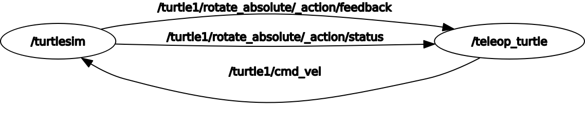
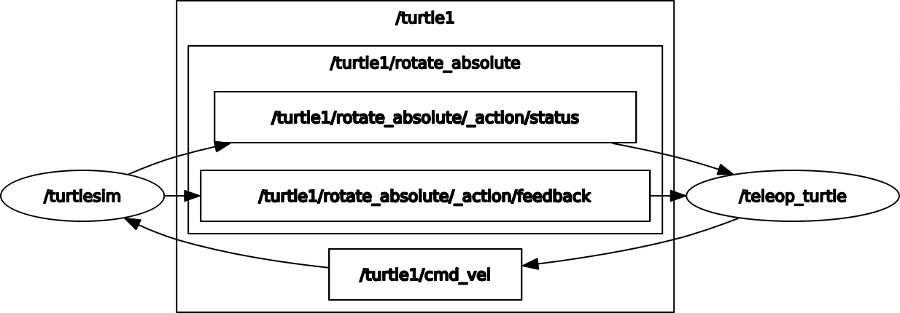

* Relaunch turtlesim with a different name
```
ros2 run turtlesim turtlesim_node --ros-args -r __node:=my_turtle
```
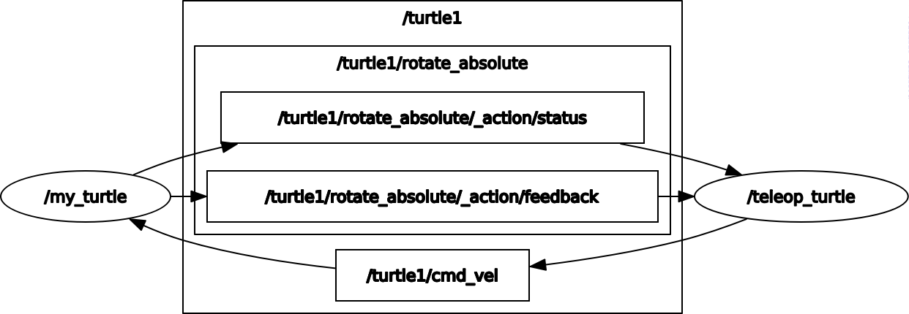


## ROS2 Topics: Make Your Nodes Communicate Between Each Other

* A topic is a named bus over which nodes exchage messages.
* Unidirectional data stream (publisher/subscriber)
* Anonymous
* A topic has a message type.
* Can be written in Python, C++,... directly inside ROS nodes.
* A node can have many publishers/subscribers for many different topics.

### Debug ROS2 Topics with Command Line Tools

* 
```
ros2 topic ...
```

* To see topics currently active
```
ros2 topic list
```

* To see info about a topic
```
ros2 topic info <topic_name>
```

* To echo a topic
```
ros2 topic echo <topic_name>
```

* To see detailed message definition so that you know what you need to send for
this topic
```
ros2 interface show example_interfaces/msg/String
```

* To get publishing frequency for a topic
```
ros2 topic hz <topic_name>
```

* To know the bandwidth used for the node
```
ros2 topic bw <topic_name>
```

* To publish directly from terminal to a topic
```
ros2 topic pub -r 10 <topic_name> example_interfaces/msg/String "{data: 'hello from terminal'}"
```
Publish at 10 Hz to topic with data-type.

* For nodes: To see all active nodes
```
ros2 node list
```

* To see which topic this node is publishing to or subscribing from
```
ros2 node info <node_name>
```

### Remap a Topic at Runtime

* We know how to rename a node
```
ros2 run my_py_pkg robot_news_station --ros-args -r __node:my_station
```

* To rename a topic
```
ros2 run my_py_pkg robot_news_station --ros-args -r __node:my_station -r
robot_news:=my_news
```
**Remember that when subscribing, you need to change the name of the topic too.**
```
ros2 run my_py_pkg smartphone --ros-args -r robot_news:=my_news
```

### Monitor Topics with rqt and rqt_graph

* Start a publisher in one terminal
```
ros2 run my_cpp_pkg robot_news_station
```

* Start a subscriber in another terminal
```
ros2 run my_py_pkg smartphone
```


* Start another publisher with a different name
```
ros2 run my_py_pkg robot_news_station --ros-args -r __node:=my_station
```

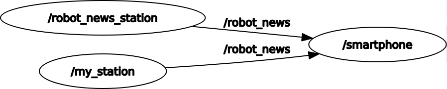

* You can add another publisher
```
ros2 run my_py_pkg robot_news_station --ros-args -r __node:=my_station2
```

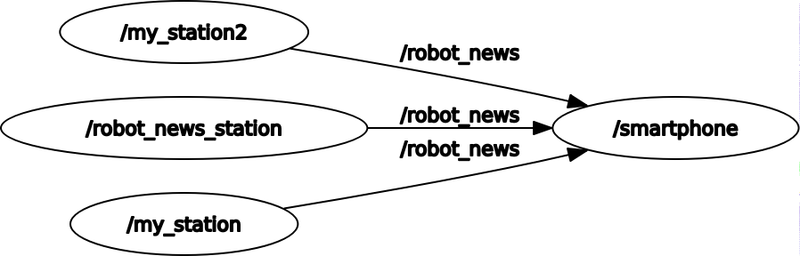

* You can add another subscriber
```
ros2 run my_py_pkg smartphone --ros-args -r __node:=smartphone2
```

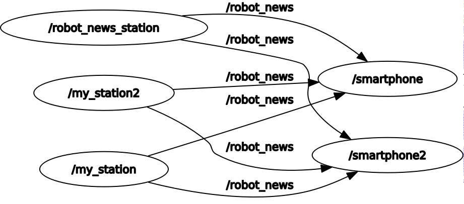
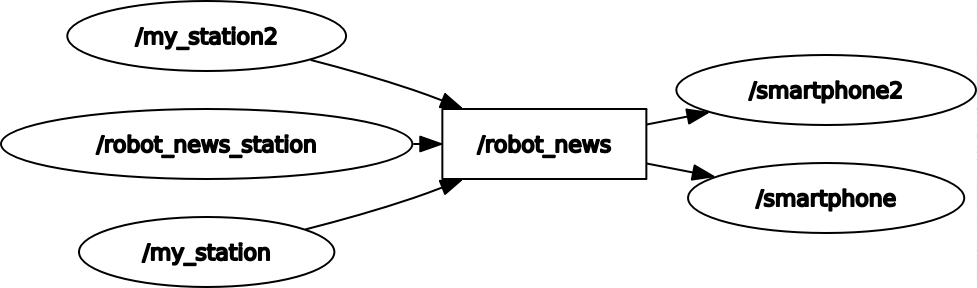

### ROS Topic Conclusion
A topic is:
* A named bus over which nodes exchange messages.
* Used for unidirectional data streams.
* Anonymous: publishers don't know who is subscribing, and subscribers don't know
who is publishing.

To implement topics in your ROS2 application:
* First create a node (or start from an existing one), then inside your node you
can create any number of publishers/subscribers.

* A publishers and subscriber must publish/subscribe to the same topic name, and
use the same data type. Those are the 2 conditions for successful topic communication.

* Then, once you've added some publishers/subscribers in your nodes, just launch
your nodes, and the communication starts! You can debug them using the "ros2"
command line tool, as well as rqt.


## ROS2 Services - Client/Server Communication Between Nodes

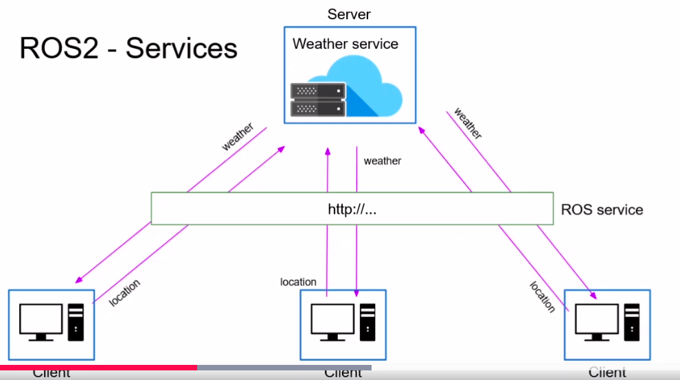

* A ROS2 Service is a client/server system.
 * Synchronous or asynchronous.
 * One message type for Request, one message type for Response.
 * Can be written in Python, C++, ... directly inside ROS nodes.

* Every service defintion has 3 dashes (---) which is the separation between
the request and the response.

* List the services
```
ros2 service list
```

* Call a ROS2 Service
```
ros2 service call /add_two_ints example_interfaces/srv/AddTwoInts "{a: 3, b: 4}"
```

* A future object is a value which maybe set in the future.
* Call is a synchronous call which will block until the response is given.
* Not recommened by ROS team as it can wait forever.
* call_async is recommended.


* In CPP ROS Client
If you call the function directly: the program starts -> we start the node
-> we create the client -> we wait for service -> if we start the server on
another terminal it passes -> we send the request -> we'll wait for the
response at future.get (problem) -> This will block the thread here
-> which means the function will not exit -> so the constructor will
not exit -> so we'll still be in this line:
"auto node = std::make_shared<AddTwoIntsClientNode>();" -> and spin(node)
will not be executed. -> But we need spin(node) in order to get the result
from the future.
So we need to start this in a different thread so that we can continue the
execution, and the constructor can exit and we can call spin on the node.
So we create a thread object in private.

### Debug Services with ROS2 Tools

* ros2 service <list, call, find, type>

* To see all the services for all the nodes in the graph
```
ros2 service list
```
The services listed other than the one you created are for the parameters.

* With ros2 node info <node_name>, you can see the service along with its interface.

* To see the interface
```
ros2 service type /add_two_ints
```

* To see details about the interface
```
ros2 interface show example_interfaces/srv/AddTwoInts
```

* To call the service
```
ros2 service call /add_two_ints example_interfaces/srv/AddTwoInts "{a: 3, b: 5}"
```

* ROS2 Service Plugin for RQT
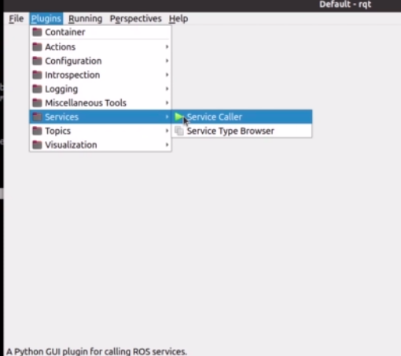
A GUI to call services.
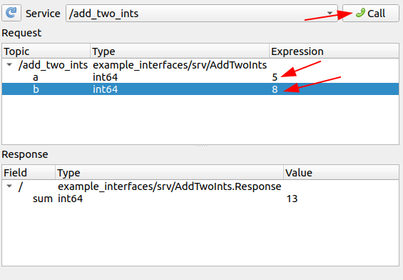

You CANNOT see the services in the rqt-graph. Only the nodes.


### Remap a Service at Runtime

* You can have two services of similar kind but with different names
```
ros2 run my_cpp_pkg add_two_ints_server
ros2 run my_cpp_pkg add_two_ints_server --ros-args -r add_two_ints:=new_name
```

* And for the client to request to that particular server
```
ros2 run my_py_pkg add_two_ints_client
ros2 run my_py_pkg add_two_ints_client --ros-args -r add_two_ints:=new_name
```


### Experiment on Services with Turtlesim

```
ros2 run turtlesim turtlesim_node
ros2 run turtlesim turtle_teleop_key
ros2 service list
```

* To clear the line put by the turtle on the screen
```
ros2 service type /clear
```
to first check the type. (NOTE: Turtle sim is still using std_srvs which has been now
replaced by example_interfaces in ROS2.)

  * You can check the interface details
    ```
    ros2 interface show std_srvs/srv/Empty
    ```
* And then call the service
```
ros2 service call /clear std_srvs/srv/Empty
```

* You can reset the turtle by
```
ros2 service call /reset std_srvs/srv/Empty
```

* You can spawn another turtle
```
# Check service type
ros2 service type /spawn # turtlesim/srv/Spawn
# Check details about the interface
ros2 interface show turtlesim/srv/Spawn
# Call the service
ros2 service call /spawn turtlesim/srv/Spawn "{x: 1.0, y: 3.0, theta: 20.0, name: "my_turtle"}
```

## ROS2 Interfaces
With topics you've seen that all the nodes publishing to a topic must use the same
data type. With services, you've seen that the clients must send a message respecting
a certain data type. And the server must respond respecting another data-type.

* Topic is defined by
    * Name (ex: /number_count)
    * Msg definition (ex: example_interfaces/msg/Int64)

* Service is also defined by:
    * Name (ex: /reset_number_count)
    * Srv definition (ex: example_interfaces/srv/SetBool): One for the request and another
for response.

* Topics and Services can be seen as communication layer tools and Interfaces are messages
  which are the actual content of the message.

* When a msg definition is made inside a package -> Colcon build system builds it. -> And
a souce code is generated for this message in any ROS2 supported language.
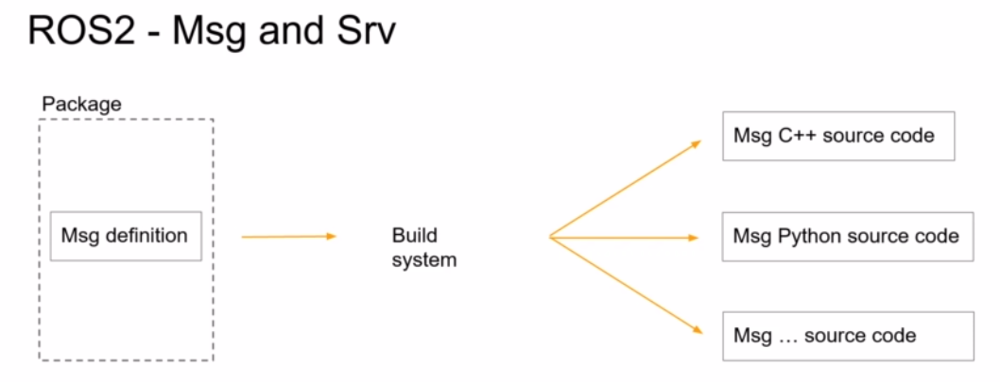 

* Type of data-types that can be used to create a msg or service definition can be found
at this [link](https://index.ros.org/doc/ros2/Concepts/About-ROS-Interfaces/).

* [ROS2 Example Interfaces](https://github.com/ros2/example_interfaces)

* [ROS2 Common Interfaces](https://github.com/ros2/common_interfaces)

* Use msg primitive types to create a message definition.
* You can create a message definition using other message definitions.

### Create and Build Your First Custom Msg

```
# Inside your ~/ros2_ws/src folder
ros2 pkg create my_robot_interfaces
cd my_robot_interfaces

# Delete the include and src folders as we don't need them
rm -r include/ src/

# Create msg folder
mkdir msg

# Configure package.xml and CMakeLists.txt
# Add these 3 lines to your package.xml
<build_depend>rosidl_default_generators</build_depend>
<exec_depend>rosidl_default_runtim</exec_depend>
<member_of_group>rosidl_interface_packages</member_of_group>

# In your CMakeLists.txt:
# Remove 3 lines under "# Default to C99"
# And remove the lines from "if(BUILD_TESTING)" to "endif()"
# As we don't need anything related to C++ here.
# And add line
find_package(rosidl_default_generators)

# And to generate source code add
rosidl_generate_interfaces(${PROJECT_NAME}
    "msg/HardWareStatus.msg"
)
```

* Use PascalCase when naming a msg.

* Build msg package with
```
colcon build --packages-select my_robot_interfaces
```

* You can see the built msg at
```
~/ros2_ws/install/my_robot_interfaces/lib/python3.8/site-packages/my_robot_interfaces/msg
```

* And the hpp file can be found at
```
~/ros2_ws/install/my_robot_interfaces/include/my_robot_interfaces/msg
```

### Use Your Custom Msg in a Python Node
If you're using autocompletion, you can add the following path to your Python path:
```
/home/sp/ros2_ws/install/my_robot_interfaces/lib/python3.8/site-packages/my_robot_interfaces
```

And add dependencies in your package.xml of your node.
```
<depend>my_robot_interfaces</depend>
```

### Create and Build Your First Custom Srv
```
cd /path/to/my_robot_interfaces/
mkdir srv
cd srv/
touch ComputeRectangleArea.srv

# After adding lines to the above file, add this line to your CMakelists.txt
"srv/ComputeRectangleArea.srv"
```
And build the package with:
```
colcon build --packages-select my_robot_interfaces
```

You can see your interface with
```
ros2 interface show my_robot_interfaces/srv/ComputeRectangleArea
```

### Debug Msg and Srv With ROS2 Tools

* See info about interfaces
```
ros2 interface show my_robot_interfaces/srv/ComputeRectangleArea
```

* List all available ROS2 interfaces
```
ros2 interface list
```

* To see all the msg and srv inside a package
```
ros2 interface package sensor_msgs
```

### Summary: How to Create a Custom Interface
* Create a new package only for your msg and srv definitions.
* Setup the package (CMakeLists.txt and package.xml)
* Create a msg/ and srv/ folders, place your custom msg definitions and srv
  definitions here.

Once you've setup your package, adding a new interface is really simple:
* Add a new file in the right folder: msg/ or srv/
* Add one line into CMakeLists.txt
* Compile with "colcon build"
* And don't forget to source your ROS2 workspace when you want to use those
  messages!

Here's what you can use inside a msg or srv definition:
* Any primitive type defined by ROS2 (most common ones: int64, float64, bool,
  string, and array of those)
* Any message you've already created in this package.
* Any message from another package. In this case don't forget to add a
  dependency for the other package in both package.xml and CMakeLists.txt.

And now, when you compile the definitions, new interfaces will be created, along
with headers/modules ready to be included in your C++ or Python nodes.


## Change Node Settings at Runtime with ROS2 Parameters

### What are ROS2 Parameters

A ROS2 parameter is a configuration value for a node useful for any kind of
setting at run time.

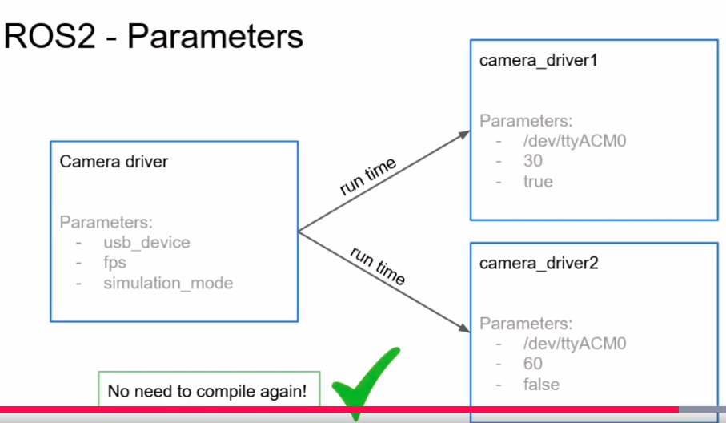

* Settings for your nodes, value set at run time.
* A parameters is specific to a node.
* ROS2 Parameter types:
    * Boolean
    * Int
    * Double
    * String
    * Lists

### Declare your parameters

* List ROS2 parameters
```
ros2 param list
```

* There's a default parameter for every node: use_sim_time

* Get the value of parameter
```
ros2 param get /number_publisher use_sim_time
```

* Each parameter is private to the node.

* To declare parameter, declare it after initialization of the node:
```
self.declare_parameter("test123")
```

* To define a parameter directly from the command line
```
ros2 run my_py_pkg number_publisher --ros-args -p test123:=3
# Output of ros param get: Integer value is: 3
# The type is set dynamically
ros2 run my_py_pkg number_publisher --ros-args -p test123:=3.13
# Output of ros param get: Double value is: 3.13

# Multiple parameters
ros2 run my_py_pkg number_publisher --ros-args -p test123:="hello" -p another_param:="hi"
```

* Declare parameter in C++
```
this->declare_parameter("name");
```

### Get Parameters from a Python Node

Inside a Python node:
```
class NumberPublisherNode(Node):
    def __init__(self):
        super().__init__("number_publisher")
        self.declare_parameter("number_to_publish")

        self.number_ = self.get_parameter("number_to_publish").value
        ...
```

And launch it with:
```
ros2 run my_py_pkg number_publisher --ros-args -p number_to_publish:=4
```

* In this case, if you don't set the parameter it'll run into an error as the
  number to publish needs to be set before running the node. To avoid this you
can set a default value.
```
self.declare_parameter("number_to_publish", 2)
```

* You can also set publish frequency with parameters, and then check it with:
```
ros2 topic hz /number
```

### Get Parameters from a C++ Node

Inside a C++ Node:
```
class NumberPublisherNode : public rclcpp::Node
{
public:
    NumberPublisherNode() : Node("number_publisher")
    {
        this->declare_parameter("number_to_publish", 2);

        number_ = this->get_parameter("number_to_publish").as_int();
        // In C++ unlike Python, the type is not dynamically cast so we have to
        // cast the type when getting the parameter.
        ...
```

Then after building it, you can launch it similar to the Python node:
```
ros2 run my_cpp_pkg number_publisher --ros-args -p number_to_publish:=3 -p
publish_frequency:=6.0
```
Here, you need to enter 6.0, as the type is cast dynamically to "int" if you
enter only "6", when using ROS2 parameter. But inside the node you're trying to
extract a double from the given parameter.

If you don't declare the parameter and try to get it, then you'll get a
ParameterNotDeclaredException error.

* When passing a list as a parameter, leave no spaces between values
```
ros2 run my_py_pkg led_panel --ros-args -p led_states:=[1,1,1]
```

* You can also additional states
```
ros2 run my_py_pkg led_panel --ros-args -p led_states:=[1,1,1,0,0]
```

* If you want to have spaces in your string parameter
```
ros2 run my_py_pkg robot_news_station --ros-args -p robot_name:="giskard 2"
```

### Summary
With parameters you don't need to modify + re-compile your code for each
different set of configuration. Just write your code once, and choose your
settings at run-time.

Using parameters is one of the first steps to make your application more
scalable.

To handle parameters:
* Don't forget to declare any parameter before you even try to use it!

* When you run your node, set values for your parameters.

* In your node's code, get the parameter's values and use them. You can also
  define default values (best practice to avoid errors at run-time).


## Scale Your Application with ROS2 Launch Files

### What is a ROS2 Launch File
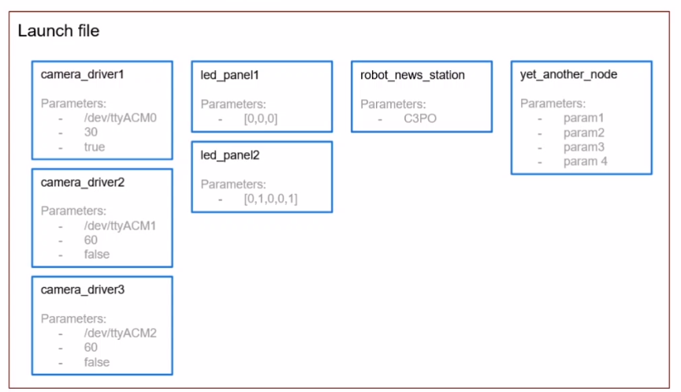

### Create and Install a Launch File

* Create a new ROS2 pkg
```
ros2 pkg create my_robot_bringup
```
The naming is a convention in ROS community, with <name_of_the_robot> followed
by "bringup".
If you don't specify a build-type, it'll automatically select ament-cmake build
type.

* Add these lines to your CMakeLists.txt
```
install(DIRECTORY
    launch
    DESTINATION share/${PROJECT_NAME}
)
```

* Launch files are python files.
```
touch number_app.launch.py
```

* Make it an executable
```
chmod +x number_app.launch.py
```

* And add these lines
```
from launch import LaunchDescription

# The name has to be exactly this because when you install the launch file the
# launch functionality will create a new program which will look for a function
# with this name to launch the application
def generate_launch_description():
    ld = LaunchDescription()
    

    return ld   
```
This is a minimal template for a launch file.

* Build the package with launch file
```
colcon build --packages-select my_robot_bringup --symlink-install
```

* Execute the launch file
```
ros2 launch my_robot_bringup number_app.launch.py
```

* To add a node inside the launch file
```
ld = LaunchDescription()

    number_publisher_node = Node(
            package="my_py_pkg",
            executable="number_publisher"
    )
  
    counter_node = Node(
            package="my_cpp_pkg",
            executable="number_counter"
    )
  
    ld.add_action(number_publisher_node)
    ld.add_action(number_counter_node)
    return ld
```

* And add "exec_depend" for those packages in the "package.xml" file.
```
<exec_depend>my_py_pkg</exec_depend>
<exec_depend>my_cpp_pkg</exec_depend>
```

### Configure your nodes in a launch file
```
# You can declare a tuple which can be used with any node
remap_number_topic = ("number", "my_number")

number_publisher_node = Node(
    package="my_py_pkg",
    executable="number_publisher",
    remappings=[
        remap_number_topic,
        #("number", "my_number") # This needs to be a tuple with the original
        # name and the replacement name
        ],
        # Parameters need to be dictionary
        parameters=[

        ]
    )
```

### Section Conclusion
With a launch file, you can start your entire application with only one command
line, in one terminal. You can add any number of nodes and fully configure them.
That wil make your application fully customizable in no time.

Setup for launch files:
* Create a new package <robot_name>_bringup (best practice).
* Create a launch/folder at the root of the package.
* Configure CMakeLists.txt to install files from this launch/ folder.
* Create any number of files you want inside the launch/ folder, ending with
  .launch.py.

Run a launch file:
* After you've written your file, use "colcon build" to install the file.
* Don't forget to source your environment.
* Start the launch file with "ros2 launch <package> <name_of_the_file>

## Final Project

* Launch the turtlesim node
```
ros2 run turtlesim turtlesim_node
```

* Check the active topics
```
ros2 topic list
```

/turtle1/pose: Gives you the current position of the turtle

* Create a new pkg
```
ros2 pkg create turtlesim_catch_them_all --build-type ament_python
```

* Create a node to control the turtle
```
touch turtle_controller.py
chmod +x turtle_controller.py
```

* To compute distance between current pose and target pose, we compute the
  euclid distance.
```
$ distance = \sqrt ((target_x - current_x)**2 + (target_y - current_y)**2) $

* To calculate the angle we use the following:

```

## Save and Replay Topic Data with ROS2 Bags
If you want to test your robot in real life with specific conditions and want to
save the data in those specific conditions for testing later, you can use ROS2
bags.

* Start a publisher node
```
ros2 run my_py_pkg number_publisher
```

* Create a directory where you want to save the data
```
mkdir bags
cd bags/
```

* Record the topic data
```
ros2 bag record /number
```
Once you exit, a file with the name of current date and time is saved.

* To specify filename
```
ros2 bag record /number -o test
```

* To check the info for the saved file
```
ros2 bag info test/
```

* To replay the bag
```
ros2 bag play test
```
You can listen to the topic /number again although the original publisher is
not actually running.
You can also run the subscriber node.
```
ros2 topic echo /number
ros2 run my_cpp_pkg number_counter
```

* You can record two topics with the same name
```
ros2 bag record /my_number /my_number_count -o test2
```

* To record all topics
```
ros2 bag record -a -o test3
```

### What you've learned
* ROS2: what, how, when, why?
* Install and configure ROS2
* ROS2 Core concepts
  * Packages
  * Nodes
  * Topics
  * Services
  * Interfaces (Msg and Srv)
  * Parameters
  * Launch files

* In Python and C++
* ROS2 Tools
  * ros2 cli
  * rqt(graph, srv, topic,..)
  * Build system

* Complete project with Turtlesim
* Best Practices

## Troubleshooting and Other Links
* [Installing Gazebo11 with ROS2](https://stackoverflow.com/questions/67302265/gazebo-11-does-not-run/67497644#67497644)
* [Getting Started With MoveIt2](http://moveit2_tutorials.picknik.ai/doc/getting_started/getting_started.html)
